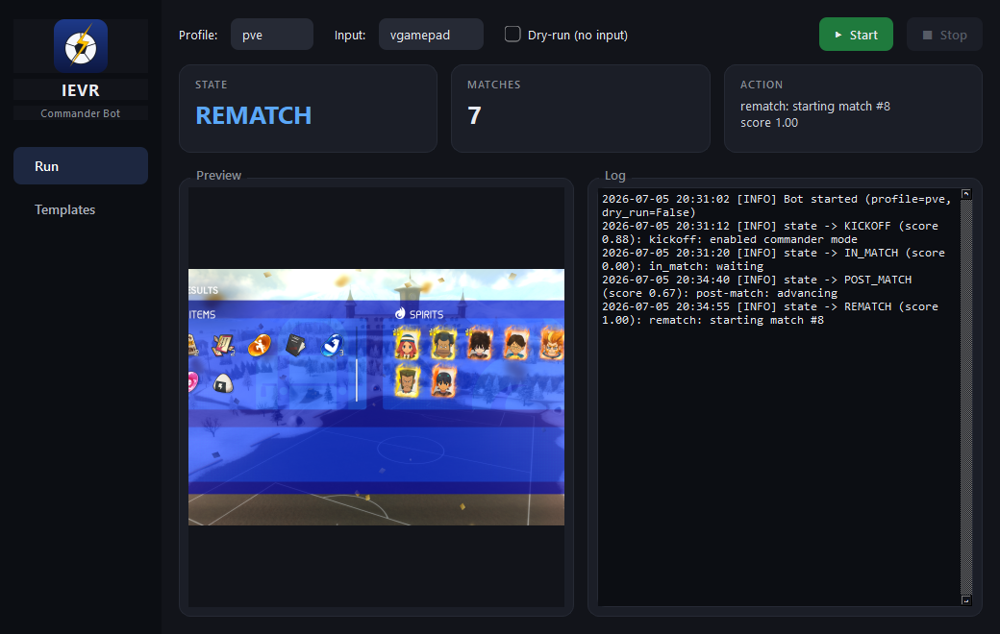
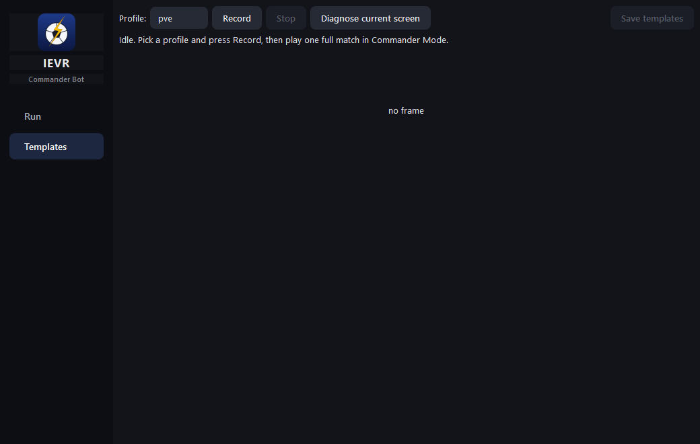

# IEVR Commander Bot

<p align="center">
  
</p>

An autonomous bot that grinds **Inazuma Eleven: Victory Road** PvE matches on its
own, using the game's built-in **Commander Mode**. The game's AI plays the match;
the bot watches the screen, recognizes each menu, and presses the right buttons to
loop matches forever — hands-free grinding.

Everything ships as a **single `IEVR.exe`** — just double-click it. No Python, no
setup files, no folders to manage.



## Features

- **Fully autonomous match loop** — starts a match, enables Commander Mode, waits
  through kickoff / goals / half-time / full-time, then confirms the **Rematch**
  screen and goes again.
- **Screen recognition via OCR** — reads the on-screen text with RapidOCR (offline,
  no internet) and matches it against per-state keywords. Resolution-independent.
- **Optional image templates** as a fallback, captured from inside the app.
- **Background / alt-tab friendly** — grabs the game window directly via the Win32
  `PrintWindow` API, so it keeps seeing the game even behind other windows. Uses a
  virtual Xbox controller (**vgamepad**), which many games keep reading while
  unfocused.
- **Live dashboard** — current state (color-coded), matches completed, last action,
  a live preview of what the bot sees, and a running log.
- **Built-in setup & diagnostics** — record templates and diagnose any screen from
  the GUI; no command line needed.

## Quick start

1. Download / build **`IEVR.exe`** (see below) and double-click it.
2. Install the **ViGEmBus** driver once (needed for virtual controller input):
   <https://github.com/ViGEm/ViGEmBus/releases> (then reboot).
3. Launch the game in a **fixed-resolution / borderless window** and make sure it
   **keeps running while unfocused** (disable "pause when unfocused" if present).
4. In the bot: pick the **pve** profile, press **▶ Start**, and leave the game at
   the main menu. It takes over from there.

> Captured templates and logs are written to `%LOCALAPPDATA%\IEVR\`. The exe itself
> stays a single self-contained file you can copy anywhere.

## How it works

Each poll (~2.5×/second) the bot:

1. Grabs a frame from the game window.
2. Runs the detector — OCR reads the visible text and picks the `GameState` whose
   keywords match with the highest confidence (e.g. the results screen shows
   `RESULTS` + a `Rematch` button → `REMATCH`).
3. The state machine performs the matching action (press **A** to confirm, enable
   Commander Mode at kickoff, dismiss error dialogs, etc.).
4. A watchdog presses cancel if it ever gets stuck on an unknown screen.

Every state change is written to `ievr.log`, so an unattended run leaves a full,
readable timeline.

## Recording templates (Templates tab)

Templates are an optional OCR fallback. Instead of the old prompt-driven capture,
the bot records a whole match itself and produces the templates for you:



1. **Templates** tab → pick a profile → **Record**.
2. Play one full match in Commander Mode, then **Stop**.
3. The bot labels the frames with its own detector and shows a per-state review
   grid with a suggested crop you can drag/resize.
4. **Save templates** writes the cropped PNGs to `%LOCALAPPDATA%\IEVR\templates\`.

The **Diagnose current screen** button grabs one frame, saves it as a PNG, and
reports exactly what OCR reads and which state is detected — handy when a screen
isn't recognized.

## Build from source

Requires Python 3.11+ (developed on 3.14) on Windows.

```powershell
py -3.14 -m venv .venv
.venv\Scripts\python -m pip install -r requirements.txt

# Run from source:
.venv\Scripts\python run_gui.py

# Or build the single-file exe (regenerates the icon first if needed):
.venv\Scripts\python tools\make_icon.py
.venv\Scripts\python build_exe.py     # -> dist\IEVR.exe
```

Headless / CLI: `.venv\Scripts\python main.py --profile pve` (add `--dry-run` to
observe without sending input, `--controller keyboard` for the keyboard fallback).

## Tests

```
.venv\Scripts\python -m pytest -q
```

## Tuning

Profiles live in `profiles/*.yaml` (bundled read-only into the exe — edit and
rebuild to change them):

- `ocr.keywords` — the words that identify each screen. Prefer distinctive phrases.
- `timings` — poll interval, tap cooldown, and how long before the watchdog steps in.
- `capture_backend` — `window` (default, works in background) or `screen`.
- `window_title` — a substring of the game window title (default `INAZUMA ELEVEN`).

## Disclaimer

For **personal, offline PvE grinding** only. Automating online / Ranked play may
violate the game's Terms of Service — don't. This project is not affiliated with
Level-5 or the Inazuma Eleven franchise.
